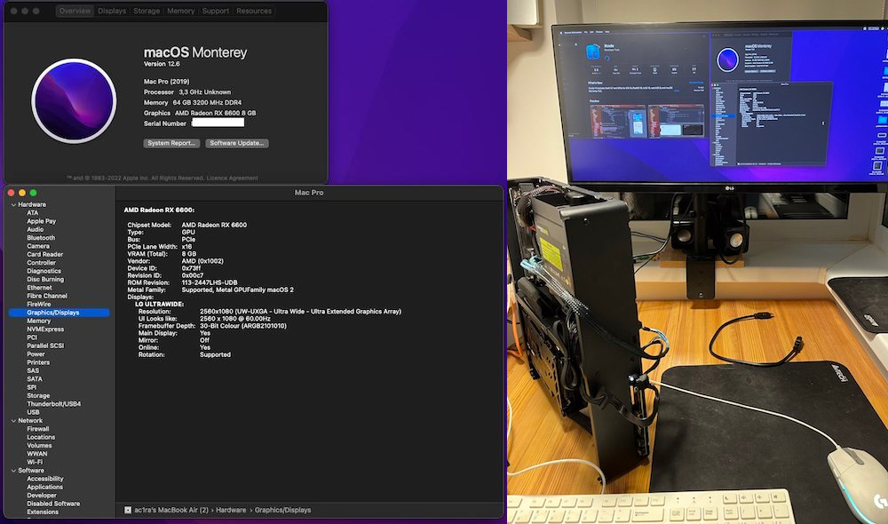
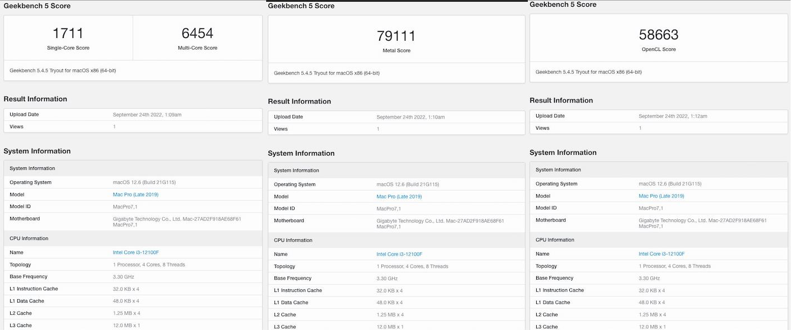

# Gigabyte H610I DDR4 EFI Hackintosh
[GUIDE] Installing macOS Monterey (12.x) on Gigabyte H610I DDR4 [OpenCore 0.8.2]

##### UPD 28.08.2023: 

- System updated to MacOS Venture 13.5. Fixed minor problems.
- Don't forget update serial number for MacPro 7.1.

##### UPD 28.12.2022: 

- fixed with Processor type on About This MacOS
- System updated to MacOS Monterey 12.6.2. I recommend update, because update fixed problems with memory manager, when system slowed down durning load app.

### Overview
[Thanks Fu-Yuxuan-hub for make EFI](https://github.com/Fu-Yuxuan-hub/General-EFI-for-H610-B660-Z690.git)

My computer on base 12gen Intel. Motherboard is Gigabyte H610I DDR4 with MacOS 12.x. All devices work very well. Sleep-mode works.

#### Performance

#### Specs
- **CPU:** 12th Gen Intel(R) Core(TM) i3-12100F
- **RAM:** 2x32Gb DDR4 A-Data Premier [AD4U320032G22-SGN] 3200 Mhz
- **SSD:** 256Gb 2.5" Digma Run S9 DGSR2256GS93T, SATA III
- **GPU:** 8Gb Sapphire Pulse AMD Radeon RX6600 
- **Ports:** USB 2.0/USB 3.0/LAN/3'5 Jack
- **Case:** Fractal Design Node 202 with riser PCI-e x16 3.0
- **Power Suppy:** 650W SFX Chieftec CSN-650C 

#### Don't work
- VGA-port

#### BIOS settings
BIOS - F5
##### Disabled:
- Fast Boot
- VT-d (**enable if DisableMapper Quirks set True)** 
- CFG Lock
- Secure Boot
- Parallel Port
- Serial Port
- Resizable BAR Support

##### Enabled:
- VT-x
- UEFI startup mode
- Above 4G decoding
- Hyper-Threading
- Execute Disable Bit
- EHCI/XHCI Hand-off
- OS type: Windows 10 UEFI Mode
- PCI-e x16 switched to Gen3.0 (**If Videocard connect to PCI-e x16 Riser**)

#### Creating USB
**I recommend to create on the USB-flash with USB3.0, because the install will very long.** 

[**Read Dortania GUIDE for creating USB bootloader**](https://dortania.github.io/OpenCore-Install-Guide/installer-guide/mac-install.html#downloading-macos-modern-os)

#### Createinstallmedia method

This is the same mechanism you would use to create a USB installer for a real Mac Monterey.

It is a single line, executed in Terminal:

> sudo /Applications/Install\ macOS\ Monterey.app/Contents/Resources/createinstallmedia --volume /Volumes/MyVolume

USB bootloader is ready.

#### Post Installation

After installation mount local EFI disk. Terminal:

> sudo dislutil list

> sudo diskutil mount disk0s1 (see diskutil list)

Copy EFI folder to EFI partition.

**OC - boot-args:**
> keepsyms=1 debug=0x100 agdpmod=pikera -wegnoigpu alcid=66

Reboot system. MacOS Monterey is ready.

**Enjoy it!**
